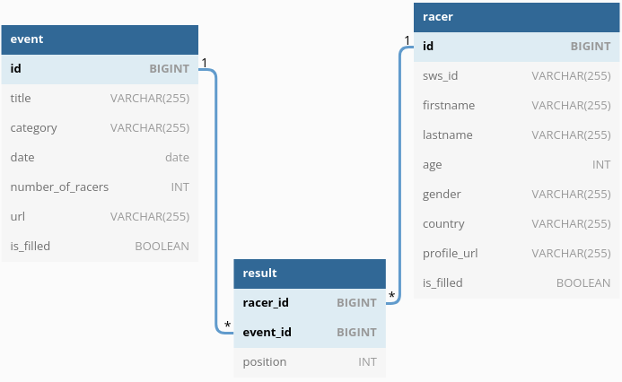

# Restful бэкенд для картинга на Spring Boot

---

## Оглавление
1. [Что это за проект?](#what-is-this)
2. [Как запустить?](#how-to-run)
3. [Откуда данные и доменная модель?](#data-source)
4. [Получение данных. Веб-скраперы](#web-scraper)
5. [База данных и Flyway](#database--flyway)
6. [HATEOAS и Paging](#hateoas--paging)
7. [Ендпоинты](#endpoints)
8. [Mapstruct и DTO](#mapstruct--dto)
9. [Junit и Mockito](#junit--mockito)

**Использованные технологие:**   
Jsoup, Spring Boot, H2 DB, Flyway, Lombok, Mapstruct, Junit, Mockito,   
Swagger, Maven

---

## What is this?
Данный вебсервис предоставляет Restful API для взаимодействия с данными  
полученными с сайта [Sodi World Series - SWS](https://www.sodiwseries.com/en-gb/).

---

## How to run?
В проекте используется Java 11, Spring Boot 2.7.0, [Maven](https://maven.apache.org/).  
_(Я использовал openjdk 11.0.12)_.

**Запуск через IDE:**  
Склонировать репозиторий в удобное место и запустить средствами IDE.

**Запуск через консоль:**  
Для запуска через консоль потребуется установленный Maven и Java 11.  
1. Склонировать репозиторий в удобное место
2. Перейти в корневой каталог проекта: `cd /sws-rest-backend`  
3. Запустить Maven: `mvn clean package`
4. Запустить java приложение: `java -jar target/backend-0.0.1.jar`

**Склонировать репозиторий:**
```
git clone https://github.com/vml1337j/sws-rest-backend.git
```

[_(Данные для теста)_](#database--flyway)

---

## Data source
Источником данных не является весь сайт SWS, а только то что относится  
к конкретному [трэку](https://www.sodiwseries.com/ru-ru/tracks/mayak-71.html).
_(Меня интересовали только эти данные)_  
Для получения данных с сайта были реализованы [**веб-скраперы**](#web-scraper), при помощи  
библиотеки [Jsoup](https://jsoup.org/).

### Данные
**Доменая модель и связи:**  



Главной идей для получения данных была _"ленивая загрузка"_, т.е. не все данные  
получаются за 1 проход веб-скрапера, это отразилось на модели данных  
_(поле isFilled указывает на заполненость модели)_.

---

## Web Scraper
Логика получение данных с сайта SWS, реализована в классах из пакета  
`src/main/java/vml1337j/sws/rest/utils`.

EventScraper реализует получение данных о гонках.  
RacerScraper реализует получение данных о гонщиках.

SwsUtils - класс который объединяет логику веб-скраперов.

---

## Database & Flyway
Для теста доступна база данных H2, которая заполняется скриптами миграции, при  
помощи flyway.   
После запуска приложения, можно получить доступ к веб-консоли H2:  
http://localhost:8080/h2-console/  
_(данные для входа в веб-консоль H2)_
```
Driver Class: org.h2.Driver
JDBC URL: jdbc:h2:mem:for-test
User Name: sa
Password: (оставить пустым)
```
### Тестовые данные и таблицы
Тестовые данные будут заполнены при помощи файлой миграции `V1__init_db.sql` и  
`V2__add_test_data.sql`, которые находятся в пакете `src/main/resources/db/migration`.

---

## HATEOAS & Paging
### HATEOAS
Архитектура REST предполагает наличие [HATEOAS](https://ru.wikipedia.org/wiki/HATEOAS).  
В Spring Boot этого можно добиться с помощью зависимости `spring-boot-starter-hateoas`.  
Прочитать про это можно [тут](https://docs.spring.io/spring-hateoas/docs/current/reference/html/#preface). 

Добавление _"гипермедии"_ происходит в ассемблерах из пакета `src/main/java/vml1337j/sws/rest/api/assembler`  
и частично в контроллерах.  
С учетом этого в ответ добавляются ссылки на сопутствующие ресурсы.

### Paging
Чтобы не возвращать в одном ответе все данные, реализована _"пагинация"_.  
_(HATEOAS поддерживается, ответ содержит ссылки на дополнительные страницы)_


_(Ответ сервера имеет тип [hal+json](https://ru.wikipedia.org/wiki/Hypertext_Application_Language),
а не просто json. Примеры в разделе про [**контроллеры**](#endpoints))_

---

## Endpoints

К проекту подключен Swagger. Запустив **проект**, можно воспользоваться  
_"юаем"_, который расположен на http://localhost:8080/swagger-ui/index.html.

### EventController  
REST контроллер для доступа к гонкам.

1. `GET http://localhost:8080/api/v1/events`  
Возвращает _"пагинированные"_ гонки из бд.  
Пример ответа _(элементы списка eventDtoList опущены для краткости)_:
```json
{
  "_embedded": {
    "eventDtoList": [
      {
        "id": 47812,
        "title": "18 STAGE Race 2 - SWS AIMOL MAYAK - JUNIOR CUP 2021",
        "category": "Junior CUP",
        "date": "2021-09-19",
        "numberOfRacers": 28,
        "eventPageUrl": "https://www.sodiwseries.com/ru-ru/races/mayak/18-stage-race-2-sws-aimol-mayak-junior-cup-2021-47812.html",
        "_links": {
          "self": {
            "href": "http://localhost:8080/api/v1/events/47812"
          },
          "results": {
            "href": "http://localhost:8080/api/v1/events/47812/results"
          }
        }
      },
      ...
    ]
  },
  "_links": {
    "first": {
      "href": "http://localhost:8080/api/v1/events?page=0&size=10"
    },
    "self": {
      "href": "http://localhost:8080/api/v1/events?page=0&size=10"
    },
    "next": {
      "href": "http://localhost:8080/api/v1/events?page=1&size=10"
    },
    "last": {
      "href": "http://localhost:8080/api/v1/events?page=3&size=10"
    }
  },
  "page": {
    "size": 10,
    "totalElements": 38,
    "totalPages": 4,
    "number": 0
  }
}
```

2. `GET http://localhost:8080/api/v1/events/{event_id}`  
Возвращает гонку по id.  
Пример ответа:
```json
{
  "id": 47812,
  "title": "18 STAGE Race 2 - SWS AIMOL MAYAK - JUNIOR CUP 2021",
  "category": "Junior CUP",
  "date": "2021-09-19",
  "numberOfRacers": 28,
  "eventPageUrl": "https://www.sodiwseries.com/ru-ru/races/mayak/18-stage-race-2-sws-aimol-mayak-junior-cup-2021-47812.html",
  "_links": {
    "self": {
      "href": "http://localhost:8080/api/v1/events/47812"
    },
    "results": {
      "href": "http://localhost:8080/api/v1/events/47812/results"
    },
    "events": {
      "href": "http://localhost:8080/api/v1/events"
    }
  }
}
```

3. `GET http://localhost:8080/api/v1/events/{event_id}/results`  
Возвращает результаты гонки по id.  
Пример ответа _(элементы списка eventResultDtoList опущенны для краткости)_:
```json
{
  "_embedded": {
    "eventResultDtoList": [
      {
        "racerId": 57615,
        "position": 1,
        "firstname": "Daniil",
        "lastname": "Lashin",
        "gender": "MALE",
        "country": "Rus",
        "_links": {
          "racer": {
            "href": "http://localhost:8080/api/v1/racers/57615"
          }
        }
      },
      ...
    ]
  },
  "_links": {
    "self": {
      "href": "http://localhost:8080/api/v1/events/47812/results"
    },
    "event": {
      "href": "http://localhost:8080/api/v1/events/47812"
    },
    "events": {
      "href": "http://localhost:8080/api/v1/events"
    }
  }
}
```

---

### RacerController
REST контроллер для доступа к гонщикам.
1. `GET http://localhost:8080/api/v1/racers`  
Возвращает _"пагинированных"_ гонщиков из бд.  
Пример ответа _(элементы списка racerDtoList опущенны для краткости)_:
```json
{
  "_embedded": {
    "racerDtoList": [
      {
        "id": 38398,
        "swsId": "RU-MAY-038398",
        "firstname": "Vladimir",
        "lastname": "Yanchenko",
        "age": 14,
        "gender": "MALE",
        "country": "Rus",
        "profileUrl": "https://www.sodiwseries.com/ru-ru/drivers/38398.html",
        "_links": {
          "self": {
            "href": "http://localhost:8080/api/v1/racers/38398"
          },
          "results": {
            "href": "http://localhost:8080/api/v1/racers/38398/results"
          }
        }
      },
      ...
    ]
  },
  "_links": {
    "first": {
      "href": "http://localhost:8080/api/v1/racers?page=0&size=10"
    },
    "self": {
      "href": "http://localhost:8080/api/v1/racers?page=0&size=10"
    },
    "next": {
      "href": "http://localhost:8080/api/v1/racers?page=1&size=10"
    },
    "last": {
      "href": "http://localhost:8080/api/v1/racers?page=4&size=10"
    }
  },
  "page": {
    "size": 10,
    "totalElements": 44,
    "totalPages": 5,
    "number": 0
  }
}
```

2. `GET http://localhost:8080/api/v1/racers/{racer_id}`  
Возвращает гонщика по id.  
   Пример ответа:
```json
{
  "id": 38398,
  "swsId": "RU-MAY-038398",
  "firstname": "Vladimir",
  "lastname": "Yanchenko",
  "age": 14,
  "gender": "MALE",
  "country": "Rus",
  "profileUrl": "https://www.sodiwseries.com/ru-ru/drivers/38398.html",
  "_links": {
    "self": {
      "href": "http://localhost:8080/api/v1/racers/38398"
    },
    "results": {
      "href": "http://localhost:8080/api/v1/racers/38398/results"
    },
    "racers": {
      "href": "http://localhost:8080/api/v1/racers"
    }
  }
}
```

3. `GET http://localhost:8080/api/v1/racers/{racer_id}/results`  
Возвращает результаты гонщика по id.  
Пример ответа _(элементы списка racerResultDtoList опущенны для краткости)_:
```json
{
  "_embedded": {
    "racerResultDtoList": [
      {
        "eventId": 47815,
        "position": 4,
        "title": "20 STAGE Race 1 - SWS AIMOL MAYAK - JUNIOR CUP 2021",
        "date": "2021-10-17",
        "category": "Junior CUP",
        "_links": {
          "event": {
            "href": "http://localhost:8080/api/v1/events/47815"
          }
        }
      },
      ...
    ]
  },
  "_links": {
    "self": {
      "href": "http://localhost:8080/api/v1/racers/38398/results"
    },
    "racer": {
      "href": "http://localhost:8080/api/v1/racers/38398"
    },
    "racers": {
      "href": "http://localhost:8080/api/v1/racers"
    }
  }
}
```

---

## Mapstruct & DTO
В проекте используется библиотека [Mapstruct](https://mapstruct.org/), для 
простой конвертации Entity в Dto.  
_(Маперры находятся в `src/main/java/vml1337j/sws/rest/api/mapper`)_  
_(Dto в `src/main/java/vml1337j/sws/rest/api/dto`)_

---

## Junit & Mockito
В проекте протестированы веб-скраперы и слой сервисов.  
Тесты доступны в пакете `src/test/java/vml1337j/sws/rest`.

_(Я не преследовал цель большого % покрытия. Тесты написаны для "неплоской" логики)_.

---


